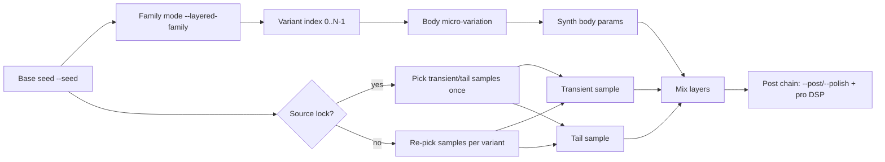

# Sound Generator (Prompt → SFX WAV)

Generate short sound effects from a text prompt.

This project supports five engines:

- **diffusers**: AI prompt-to-audio (AudioLDM2)
- **rfxgen**: procedural chiptune-style SFX presets (coin/laser/explosion/etc)
- **samplelib**: picks + randomizes samples from ZIP sound libraries (uses ffmpeg to decode)
- **synth**: DSP synth engine (waveforms + ADSR + filters + drive)
- **layered**: hybrid engine (samplelib transient/tail + synth body)

## Setup (Windows)

1) Create a virtual env:

```powershell
python -m venv .venv
.\.venv\Scripts\Activate.ps1
```

2) Install dependencies:

```powershell
pip install -r requirements.txt
```

> Note: The first run will download model weights.

## Windows .exe builds (optional)

This repo can build Windows executables via GitHub Actions.

- The workflow is in `.github/workflows/build-exe.yml`.
- Builds produce two zipped folders:
	- `soundgen-generate-windows.zip` (CLI generator)
	- `soundgen-web-windows.zip` (Gradio UI)

How to get them:

- **GitHub Actions**: run the workflow manually (Actions → “Build Windows EXE”) and download the `soundgen-windows-exes` artifact.
- **GitHub Releases**: if you publish a release, the workflow attaches the same ZIPs to the release.

Notes:

- These builds can be large (torch/diffusers/transformers).
- Some features still require external tools (e.g. `ffmpeg` on PATH for MP3/OGG export).

## Generate from the CLI

```powershell
	python -m soundgen.generate --prompt "laser zap" --seconds 2.5 --out outputs\laser.wav
```

### Polish mode (DSP)

In addition to basic `--post` (trim/fade/normalize/EQ), you can enable a conservative “studio polish” chain:

- gentle spectral denoise
- transient shaping
- compression
- soft limiting

```powershell
python -m soundgen.generate --engine layered --polish --prompt "melee hit" --seconds 1.0 --out outputs\hit_polished.wav
```

### Named polish profiles (AAA-style chains)

If you want the post chain to feel like a “product feature”, use `--polish-profile`.
Profiles are tuned, named chains that set post/polish + a few DSP defaults (multiband/texture/reverb/EQ targets).
Like `--pro-preset`, they apply conservatively: they only override values that are still at their defaults.

```powershell
# UI: clean + click-safe
python -m soundgen.generate --engine synth --polish-profile ui_clean --prompt "ui click" --seconds 0.4 --seed 7 --out outputs\ui_click_clean.wav

# Foley: punchy impacts
python -m soundgen.generate --engine layered --polish-profile foley_punchy --prompt "melee hit" --seconds 1.0 --seed 42 --out outputs\hit_punchy.wav

# Ambience: smooth bed with loop-friendly fades
python -m soundgen.generate --engine diffusers --polish-profile ambience_loop_ready --prompt "cave ambience drone" --seconds 8 --seed 9 --post --out outputs\cave_loopy.wav

# If you want to force loop seam cleanup without a profile:
python -m soundgen.generate --engine synth --prompt "wind bed" --seconds 8 --post --loop --loop-crossfade-ms 100 --out outputs\wind_loop.wav
```

In the Web UI (`python -m soundgen.web`), use the **polish profile** dropdown next to the post/polish toggles.

### Pro controls (conditioning + DSP)

These controls are applied in the post-processing stage, so they work with any engine when `--post` or `--polish` is enabled.

**Conditioning channels**

- `--emotion {neutral,aggressive,calm,scared}`
- `--intensity <0..1>` (nudges polish defaults + can auto-enable texture/reverb)
- `--variation <0..1>` (widens some engine randomization + affects auto texture)
- `--pitch-contour {flat,rise,fall,updown,downup}`
- `--duration` (alias for `--seconds`)

**DSP modules**

- Multi-band clarity: `--multiband` (plus `--mb-*-*` crossover/gain/compression options)
- “Creature size” / formant color: `--creature-size < -1..+1 >` and `--formant-shift` (subtle; best with voice-like material)
- Procedural texture overlay: `--texture-preset {off,auto,chitter,rasp,buzz,screech}` + `--texture-amount`
- Synthetic convolution reverb: `--reverb {off,room,cave,forest,nether}` + `--reverb-mix` + `--reverb-time`

Examples:

```powershell
# A “monster-ish” layered creature with added texture + space
python -m soundgen.generate --engine layered --layered-preset creature --prompt "slimy monster hiss" --seconds 1.6 --seed 42 --post --emotion aggressive --intensity 0.8 --variation 0.7 --pitch-contour updown --multiband --creature-size -0.4 --texture-preset auto --texture-amount 0.30 --reverb cave --reverb-mix 0.14 --reverb-time 1.1 --out outputs\creature.wav

# A small UI-ish synth with multiband + a touch of room
python -m soundgen.generate --engine synth --prompt "ui click" --seconds 0.35 --seed 7 --post --emotion calm --intensity 0.35 --multiband --reverb room --reverb-mix 0.08 --reverb-time 0.7 --out outputs\ui_click.wav
```

**Diffusers multi-band (model-side, slower)**

This runs 2-3 diffusers generations (auto) and recombines low/mid/high bands for cleaner output.

```powershell
python -m soundgen.generate --engine diffusers --diffusers-multiband --diffusers-mb-mode auto --diffusers-mb-low-hz 250 --diffusers-mb-high-hz 3000 --prompt "monster roar" --seconds 2.5 --seed 123 --post --out outputs\roar_multiband.wav
```

**Pro presets (one-click “paid tool” defaults)**

`--pro-preset <key>` applies a curated preset that turns on sensible post/polish defaults plus conditioning + DSP knobs.
It applies conservatively: it only overrides values that are still at their defaults, so you can still tweak sliders/flags.

Examples:

```powershell
# Creature: Small chitter (adds texture + polish + conditioning)
python -m soundgen.generate --engine diffusers --pro-preset creature.small_chitter --prompt "monster" --seed 42 --post --out outputs\small_chitter.wav

# Environment: Cave drone (longer + darker + space)
python -m soundgen.generate --engine diffusers --pro-preset env.cave_drone --prompt "ambience" --seed 7 --post --out outputs\cave_drone.wav
```

You can use the same `--pro-preset` flag in:

- CLI single generation: `python -m soundgen.generate ...`
- Web UI: `python -m soundgen.web` (Pro controls → pro preset)
- Batch: `python -m soundgen.batch ...`
- Docs workflow: `python -m soundgen.from_docs ...`

### Export format options (non-Minecraft)

By default, `--out` writes a 16-bit PCM WAV. You can change WAV encoding or export other formats:

```powershell
# 24-bit WAV
python -m soundgen.generate --engine synth --prompt "ui click" --seconds 0.4 --out outputs\click.wav --wav-subtype PCM_24

# Resample output
python -m soundgen.generate --engine synth --prompt "ui click" --seconds 0.4 --out outputs\click_48k.wav --out-sample-rate 48000

# Export MP3 / OGG / FLAC (requires ffmpeg on PATH)
python -m soundgen.generate --engine synth --prompt "ui click" --seconds 0.4 --out outputs\click.mp3 --out-format mp3 --mp3-bitrate 192k
python -m soundgen.generate --engine synth --prompt "ui click" --seconds 0.4 --out outputs\click.ogg --out-format ogg
python -m soundgen.generate --engine synth --prompt "ui click" --seconds 0.4 --out outputs\click.flac --out-format flac
```

### Use rfxgen presets (optional)

1) Download or build `rfxgen.exe` from https://github.com/raysan5/rfxgen

Quickest on Windows (downloads the latest release asset and installs to `tools/rfxgen/rfxgen.exe`):

```powershell
./scripts/get_rfxgen.ps1
```

2) Put it at `tools/rfxgen/rfxgen.exe` (or add it to your `PATH`)

3) Generate using the procedural engine:

```powershell
python -m soundgen.generate --engine rfxgen --prompt "coin pickup" --out outputs\coin.wav
python -m soundgen.generate --engine rfxgen --preset explosion --prompt "boom" --out outputs\boom.wav
```

Common options:
- `--seconds` duration
- `--seed` for repeatable results
- `--device` `cpu` or `cuda`
- `--model` model id (default `cvssp/audioldm2`)

### Use example ZIP sound libraries (samplelib)

This repo includes example sound-library ZIPs under:

- `.examples/sound libraies/*.zip`

Generate by selecting the “best matching” filename (or a random fallback) and applying a small random pitch variation:

```powershell
python -m soundgen.generate --engine samplelib --prompt "coin pickup" --seconds 1.5 --post --out outputs\samplelib_coin.wav
```

This also writes credits:
- `outputs\samplelib_coin.wav.credits.json` (sidecar)
- For Minecraft export: `assets/<namespace>/soundgen_credits.json` inside the pack

More chaos: mix two samples together:

```powershell
python -m soundgen.generate --engine samplelib --library-mix-count 2 --prompt "coin pickup" --seconds 1.5 --out outputs\coin_mix.wav
```

Speed: the samplelib engine maintains a persistent index at `library/samplelib_index.json` by default.
Set `--library-index ""` to disable.

### DSP synth engine (synth)

```powershell
python -m soundgen.generate --engine synth --prompt "clicky ui blip" --seconds 0.7 --map-controls --post --out outputs\synth_blip.wav
```

You can force the waveform:

```powershell
python -m soundgen.generate --engine synth --synth-waveform square --prompt "retro laser" --seconds 1.2 --out outputs\laser.wav
```

You can also point at your own ZIP(s):

```powershell
python -m soundgen.generate --engine samplelib --library-zip "C:\path\to\MyLibrary.zip" --prompt "metal clank" --out outputs\clank.wav
```

### Hybrid layered engine (layered)

Composes a short transient + a tail (from `samplelib`) with a synth “body” layer for richer structure:

```powershell
python -m soundgen.generate --engine layered --prompt "coin pickup" --seconds 1.5 --post --out outputs\layered_coin.wav
```

Presets + interaction + envelopes (minimal designer controls):

```powershell
# A whooshy family you can iterate deterministically with --seed
python -m soundgen.generate --engine layered --layered-preset whoosh --seed 123 --prompt "wind swoosh" --seconds 2.0 --out outputs\whoosh.wav

# Make the hit sharper + duck the body under the transient
python -m soundgen.generate --engine layered --layered-preset impact --layered-transient-attack-ms 0.5 --layered-transient-decay-ms 60 --layered-duck 0.6 --prompt "melee hit" --seconds 1.0 --out outputs\hit.wav
```

Curve shapes + spectral tilt + family micro-variation:

```powershell
# Keep character locked (same seed), vary subtly per variant
python -m soundgen.generate --engine layered --minecraft --namespace mymod --event ui.hit --variants 3 --seed 123 --layered-family --layered-micro-variation 0.35 --layered-curve exponential --layered-transient-tilt 0.3 --layered-body-tilt -0.2 --layered-tail-tilt 0.6 --prompt "melee hit"
```

Source lock (pin transient/tail samples across variants):

```powershell
# Keep the sample-backed transient + tail pinned, while still allowing per-variant micro-variation
python -m soundgen.generate --engine layered --minecraft --namespace mymod --event ui.hit --variants 3 --seed 123 --layered-family --layered-source-lock --layered-micro-variation 0.35 --prompt "melee hit"
```

Granular texture (hybrid "diffusion + granular" feel, but DSP):

```powershell
# Add a crisp insect/rasp texture layer into the body
python -m soundgen.generate --engine layered --prompt "insect chitter" --seconds 1.5 --layered-granular-preset chitter --layered-granular-amount 0.45 --layered-granular-spray 0.60 --post --out outputs\chitter.wav
```

Granular preset showcase (generate local audio snippets)

To keep the repo clean, these snippets are generated locally (not committed). Each command writes a short WAV you can audition.

| Preset | What it’s good at | Suggested starting point |
|---|---|---|
| `chitter` | insectoid chatter, skittering texture | `--layered-granular-amount 0.40` `--layered-granular-spray 0.60` `--layered-granular-grain-ms 18` |
| `rasp` | gritty creature throat / undead rasp | `--layered-granular-amount 0.30` `--layered-granular-spray 0.35` `--layered-granular-grain-ms 35` |
| `buzz` | wasp/bee buzz, electrical fuzz layer | `--layered-granular-amount 0.35` `--layered-granular-spray 0.75` `--layered-granular-grain-ms 10` |
| `screech` | sharp scrapes, squeals, shrieks | `--layered-granular-amount 0.25` `--layered-granular-spray 0.25` `--layered-granular-grain-ms 70` |

```powershell
python -m soundgen.generate --engine layered --seconds 1.5 --seed 100 --prompt "insect chitter" --layered-granular-preset chitter --layered-granular-amount 0.40 --layered-granular-spray 0.60 --layered-granular-grain-ms 18 --post --out outputs\showcase\granular_chitter.wav
python -m soundgen.generate --engine layered --seconds 1.5 --seed 101 --prompt "creature rasp"   --layered-granular-preset rasp    --layered-granular-amount 0.30 --layered-granular-spray 0.35 --layered-granular-grain-ms 35 --post --out outputs\showcase\granular_rasp.wav
python -m soundgen.generate --engine layered --seconds 1.5 --seed 102 --prompt "wasp buzz"       --layered-granular-preset buzz    --layered-granular-amount 0.35 --layered-granular-spray 0.75 --layered-granular-grain-ms 10 --post --out outputs\showcase\granular_buzz.wav
python -m soundgen.generate --engine layered --seconds 1.5 --seed 103 --prompt "screechy scrape" --layered-granular-preset screech --layered-granular-amount 0.25 --layered-granular-spray 0.25 --layered-granular-grain-ms 70 --post --out outputs\showcase\granular_screech.wav
```

Tip: run `./scripts/make_granular_showcase.ps1` to generate all four.

How `family` + `source lock` + `micro-variation` interact (high-level):

```mermaid
flowchart LR
	A[Base seed --seed] --> B{Layered family mode?}

	B -- yes --> C[Body seed = base seed]
	B -- no --> D[Body seed = base seed + variant_index]

	E[variant_index (0..N-1)] --> D
	E --> F[Micro-variation jitter
	(deterministic per variant)]

	C --> G[Synth body params]
	D --> G
	F --> G

	H{Source lock?} --> I[Source seed =
	(override if set) else base seed]
	H -- no --> J[Source seed = body seed]

	I --> K[Pick transient sample (samplelib)]
	I --> L[Pick tail sample (samplelib)]
	J --> K
	J --> L

	K --> M[Transient layer]
	G --> N[Body layer]
	L --> O[Tail layer]
	M --> P[Mix + optional polish]
	N --> P
	O --> P
```

Layered controls: CLI ↔ Gradio mapping (quick reference)

| Concept | CLI flag(s) | Gradio (Engine=layered) |
|---|---|---|
| Family mode | `--layered-family` | “layered family mode” (checkbox) |
| Micro-variation | `--layered-micro-variation <0..1>` | “layered micro-variation” (slider) |
| Source lock | `--layered-source-lock` | “layered source lock” (checkbox) |
| Source seed override | `--layered-source-seed <int>` | “layered source seed (optional)” (number; only shown when source lock is on) |
| Envelopes (A/H/D) | `--layered-<layer>-attack-ms`, `--layered-<layer>-hold-ms`, `--layered-<layer>-decay-ms` for `transient/body/tail` | Not exposed (CLI-only) |
| Envelope curve | `--layered-curve {linear,exponential}` | “layered curve” (dropdown) |
| Spectral tilt | `--layered-transient-tilt`, `--layered-body-tilt`, `--layered-tail-tilt` | “layered transient/body/tail tilt” (sliders) |
| Granular texture | `--layered-granular-preset`, `--layered-granular-amount`, `--layered-granular-grain-ms`, `--layered-granular-spray` | “layered granular preset/amount/grain/spray” (dropdown + sliders) |
| Polish mode | `--polish` | “Polish mode (denoise/transients/compress/limit)” (checkbox) |

### Full-feature layered showcase (one-stop)

This section is a single copy/paste reference that exercises the full layered stack:

- deterministic **families** (`--seed` + `--variants` + `--layered-family`)
- pinned sample sources across variants (**source lock**) (`--layered-source-lock`)
- per-variant subtle changes (**micro-variation**) (`--layered-micro-variation`)
- “studio” finish (**polish**) (`--polish`)
- hybrid body texture (**layered granular preset**) (`--layered-granular-*`)
- extra finish (**pro DSP modules**) (`--multiband`, `--texture-*`, `--reverb`, `--creature-size`)

Visual mental model (what changes per variant vs what stays pinned):



**One command to generate a whole family into a fresh pack**

This writes multiple `.ogg` variants under a single event id, with transient/tail pinned across variants and the body subtly changing.

```powershell
python -m soundgen.generate --engine layered --minecraft --pack-root outputs\showcase_pack --namespace mymod --event sfx.showcase.layered --subtitle "Layered Showcase" --variants 6 --seed 123 --layered-family --layered-source-lock --layered-micro-variation 0.40 --layered-preset creature --layered-curve exponential --layered-duck 0.55 --layered-transient-tilt 0.25 --layered-body-tilt -0.10 --layered-tail-tilt 0.45 --layered-granular-preset auto --layered-granular-amount 0.35 --layered-granular-grain-ms 26 --layered-granular-spray 0.55 --polish --post --emotion aggressive --intensity 0.80 --variation 0.65 --pitch-contour updown --multiband --creature-size -0.35 --texture-preset auto --texture-amount 0.22 --reverb cave --reverb-mix 0.12 --reverb-time 1.1 --prompt "slimy monster hiss"
```

In-game:

```mcfunction
/playsound mymod:sfx.showcase.layered master @s
```

**Granular preset quick audition (WAVs, not Minecraft)**

These write local WAVs so you can audition the granular body texture flavors quickly:

```powershell
python -m soundgen.generate --engine layered --seconds 1.4 --seed 210 --prompt "insect chitter" --layered-granular-preset chitter --layered-granular-amount 0.40 --layered-granular-spray 0.60 --layered-granular-grain-ms 18 --polish --post --out outputs\showcase\layered_granular_chitter.wav
python -m soundgen.generate --engine layered --seconds 1.4 --seed 211 --prompt "creature rasp"   --layered-granular-preset rasp    --layered-granular-amount 0.30 --layered-granular-spray 0.35 --layered-granular-grain-ms 35 --polish --post --out outputs\showcase\layered_granular_rasp.wav
python -m soundgen.generate --engine layered --seconds 1.4 --seed 212 --prompt "wasp buzz"       --layered-granular-preset buzz    --layered-granular-amount 0.35 --layered-granular-spray 0.75 --layered-granular-grain-ms 10 --polish --post --out outputs\showcase\layered_granular_buzz.wav
python -m soundgen.generate --engine layered --seconds 1.4 --seed 213 --prompt "screechy scrape" --layered-granular-preset screech --layered-granular-amount 0.25 --layered-granular-spray 0.25 --layered-granular-grain-ms 70 --polish --post --out outputs\showcase\layered_granular_screech.wav
```

## Minecraft resource pack output (.ogg)

Minecraft resource packs use `.ogg` sound files under `assets/<namespace>/sounds/` and a `sounds.json` file.

This project can export directly into a pack folder:

```powershell
python -m soundgen.generate --engine rfxgen --minecraft --namespace mymod --prompt "coin pickup"
```

That creates/updates:
- `resourcepack/pack.mcmeta`
- `resourcepack/assets/mymod/sounds/generated/<slug>.ogg`
- `resourcepack/assets/mymod/sounds.json`

In-game you can test with:

```mcfunction
/playsound mymod:generated.<slug> master @s
```

### Variants + subtitles (recommended)

Generate multiple variants under one event id so Minecraft randomly picks:

```powershell
python -m soundgen.generate --engine rfxgen --minecraft --namespace mymod --event ui.coin --variants 5 --subtitle "Coin" --prompt "coin pickup"
```

You can also enable the Minecraft-friendly post-processing chain:

```powershell
python -m soundgen.generate --engine rfxgen --prompt "coin pickup" --post --out outputs\coin.wav
```

Then:

```mcfunction
/playsound mymod:ui.coin master @s
```

### Forge mod export

Point `--pack-root` at your mod resources folder and set `--mc-target forge`:

```powershell
python -m soundgen.generate --engine rfxgen --minecraft --mc-target forge --pack-root "C:\path\to\YourMod\src\main\resources" --namespace yourmodid --event ui.coin --prompt "coin pickup"
```

## Batch generation (manifest)

Create a JSON manifest (example: `sounds.json`):

```json
[
	{"engine": "rfxgen", "namespace": "mymod", "event": "ui.coin", "prompt": "coin pickup", "variants": 5, "subtitle": "Coin"},
	{"engine": "diffusers", "namespace": "mymod", "event": "sfx.magic", "prompt": "short magical sparkle", "seconds": 2.0, "post": true}
]
```

Run:

```powershell
python -m soundgen.batch --manifest sounds.json --pack-root resourcepack --mc-target resourcepack --zip outputs\resourcepack.zip
```

This appends a local catalog to `library/catalog.jsonl`.

## Doc → prompt workflow (pre_gen_sound)

Drop `.docx`, `.txt`, or `.md` files into `pre_gen_sound/` (this folder is gitignored).

Then run:

```powershell
python -m soundgen.from_docs --engine rfxgen --namespace mymod --event-prefix ui.docs --variants 2 --post
```

This reads each document, converts it into a prompt, and exports `.ogg` + `sounds.json` into `resourcepack/` by default.

## Optional paid API engine: Replicate

Set your token:

```powershell
$env:REPLICATE_API_TOKEN = "<your token>"
```

Then run (example only; model inputs vary by model):

```powershell
python -m soundgen.generate --engine replicate --replicate-model "owner/model" --prompt "coin pickup" --seconds 2 --out outputs\replicate.wav
```

### Requirements

- `ffmpeg` must be installed and available on your `PATH` for WAV → OGG conversion.
	- Quick install (Windows): `winget install Gyan.FFmpeg`

## Run the Web UI (Gradio)

```powershell
python -m soundgen.web
```

Then open the local URL printed in the terminal.

Web outputs:
- Always writes a WAV under `outputs/` (e.g. `outputs/web_synth.wav`).
- Writes per-sound credits next to the WAV as `*.wav.credits.json`.
- If “Export to Minecraft” is enabled, it writes `.ogg` + updates `sounds.json` and also updates pack credits at `assets/<namespace>/soundgen_credits.json`.

## Quick smoke checks

These are fast commands to verify the main paths after changes:

```powershell
# Synth + prompt-to-controls + post chain + credits sidecar
python -m soundgen.generate --engine synth --prompt "clicky ui blip" --seconds 0.7 --map-controls --post --out outputs\smoke_synth.wav

# Sample library selection + mixing + credits sidecar (uses .examples/sound libraies/*.zip)
python -m soundgen.generate --engine samplelib --library-mix-count 2 --prompt "coin pickup" --seconds 0.7 --out outputs\smoke_samplelib.wav

# Minecraft export + pack credits
python -m soundgen.generate --engine synth --minecraft --namespace mymod --event ui.blip --subtitle "UI Blip" --prompt "clicky ui blip" --seconds 0.7 --map-controls --post

# Batch manifest export (writes pack + catalog + pack credits)
python -m soundgen.batch --manifest example_manifest.json --zip outputs\resourcepack.zip
```

## Troubleshooting

- **Slow on CPU**: Try shorter durations (1–3 seconds) or use a GPU (`--device cuda`).
- **CUDA not found**: Install a CUDA-enabled PyTorch build and ensure your NVIDIA drivers are installed.
- **Audio saving issues**: This project writes WAV via `soundfile`.

## Output

Generated files go to `outputs/` by default.
